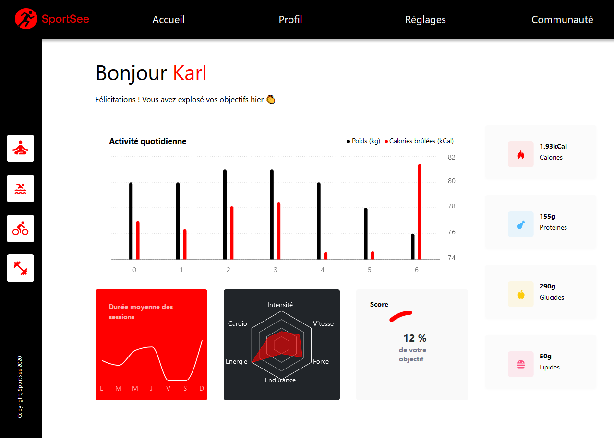

# SportSee 🇬🇧

**Personnel Dashboard**

<kbd></kbd>

## Libraries

    REACT
    RECHART

## Install

### Recommended editor

* [Visual Studio code](https://code.visualstudio.com/)

### Prerequisites

* [Git](https://git-scm.com/) to clone repos
* [nodeJS](https://nodejs.org/fr/)(version 14.20.1) to execute commands
* [npm](https://www.npmjs.com/) (version 6.14.17) to launch the application (front-end)
* [Yarn](https://yarnpkg.com/)(version 1.22.18) to launch the API (back-end)

### Dependencies

* [Recharts](https://recharts.org/en-US/) (version 2.1.15)
* [react-router-dom](https://reactrouter.com/en/6.4.5) (version 6.4.2)
* [Prop-types](https://www.npmjs.com/package/prop-types) (version 15.8.1)

### Step 1: Launching the back-end (services)

- Clone the project repo: `gh repo clone AndyRama/AndyRamaroson_12_25112021`
- Go to this folder: `cd sportsee/Server`
- Install its dependencies: `yarn install`
- Run it on port 3000 (default): `yarn run dev`

### Step 2: Launching the front-end (client)

- Go to this folder: `cd sportsee/Client`
- Install its dependencies: `npm install`
- Run it on port 3001: `npm run start`

```bash
Web Render View URL: http://localhost:3001/user/id
SportSee API provides data for id 12 and 18 users
SportSee MockApi provides data Fake for id 19 users
```
